# Documentation and Work Process

## Git Repository

```
https://github.com/yawnartey/ikim-devops-coding-challenge
```

## Working Demonstration

### 1. Spinning up the cluster via Terraform

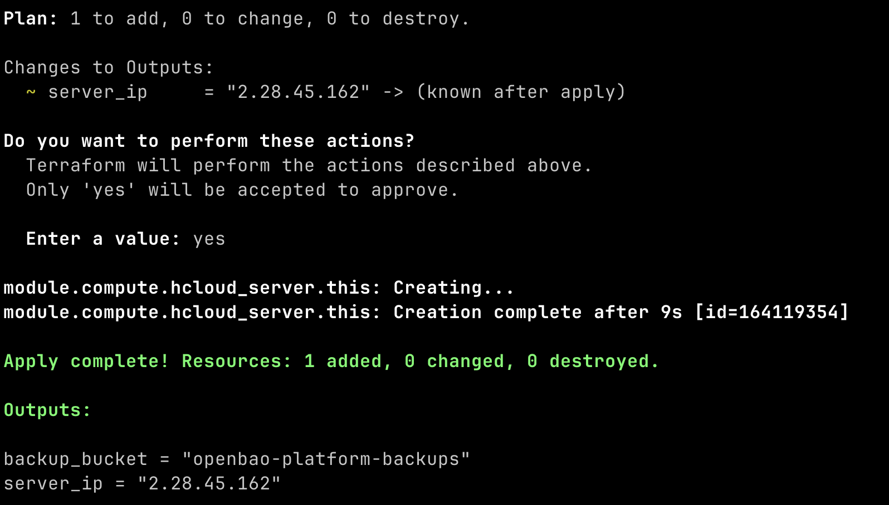

### 2. 3 control plane nodes, 3 database node and 5 worker nodes all properly labelled

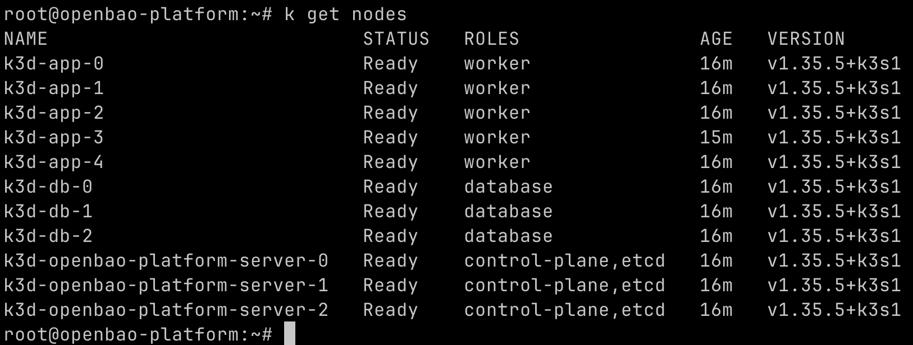

### 3. Node scheduling in place. Control plane and database nodes are tainted so no application worker lands on them

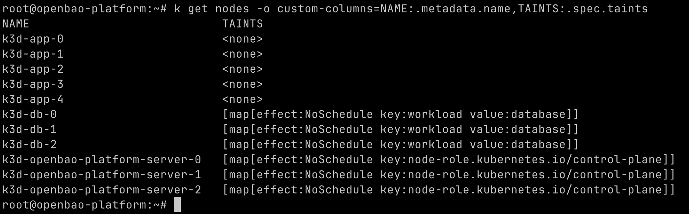
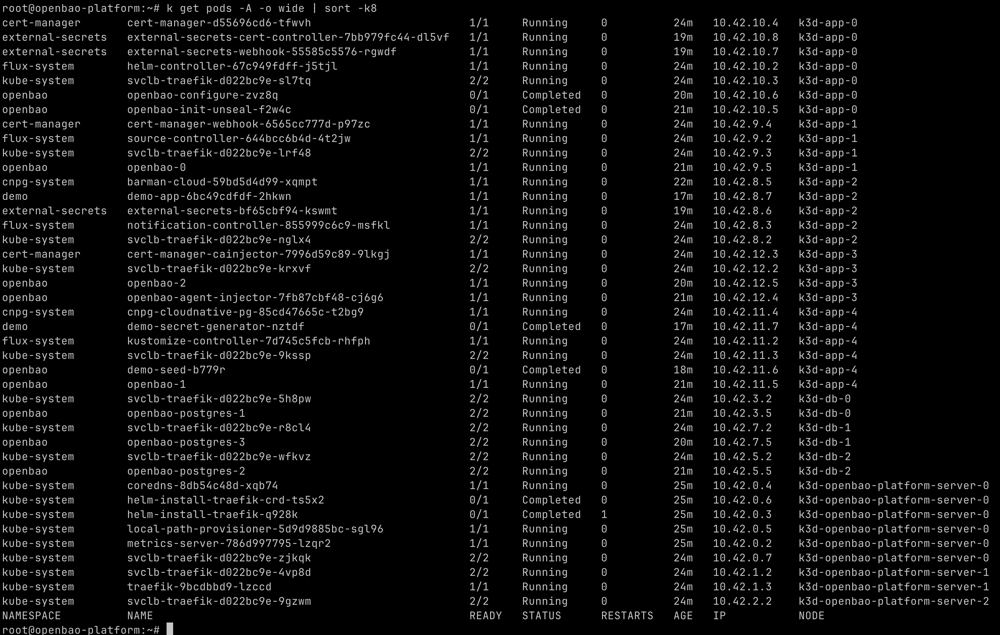

### 4. GitOps application and discpline. Flux kustomization all showing True and flux pulling from Git

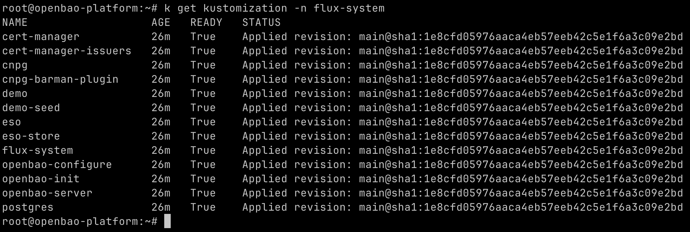
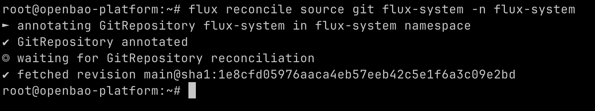

### 5. Postgres is Highly Available

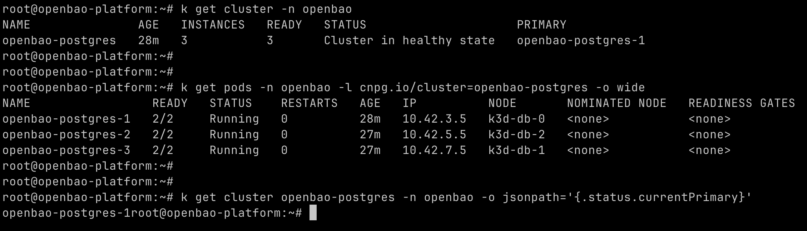

### 6. Postgres backups are automated

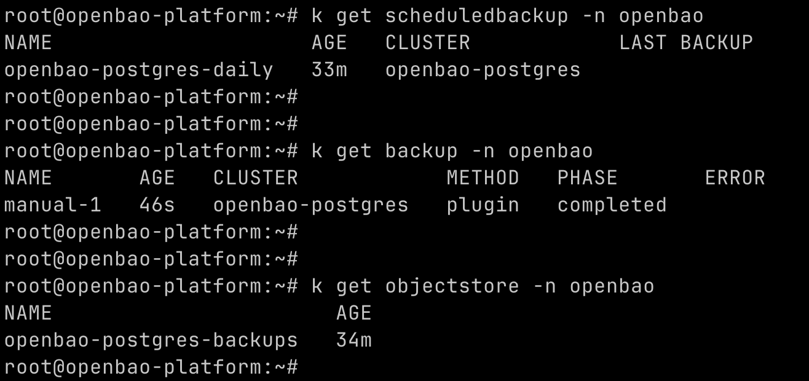
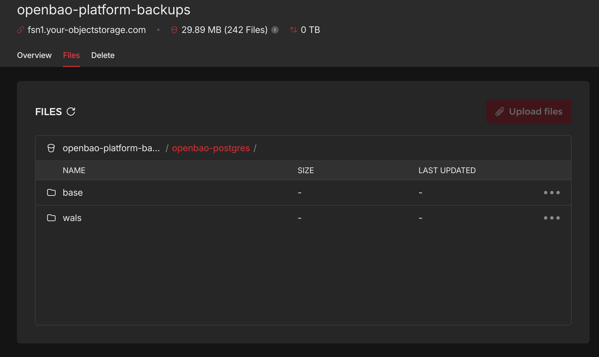

### 7. Restoring the backup by following the Restore backup guide

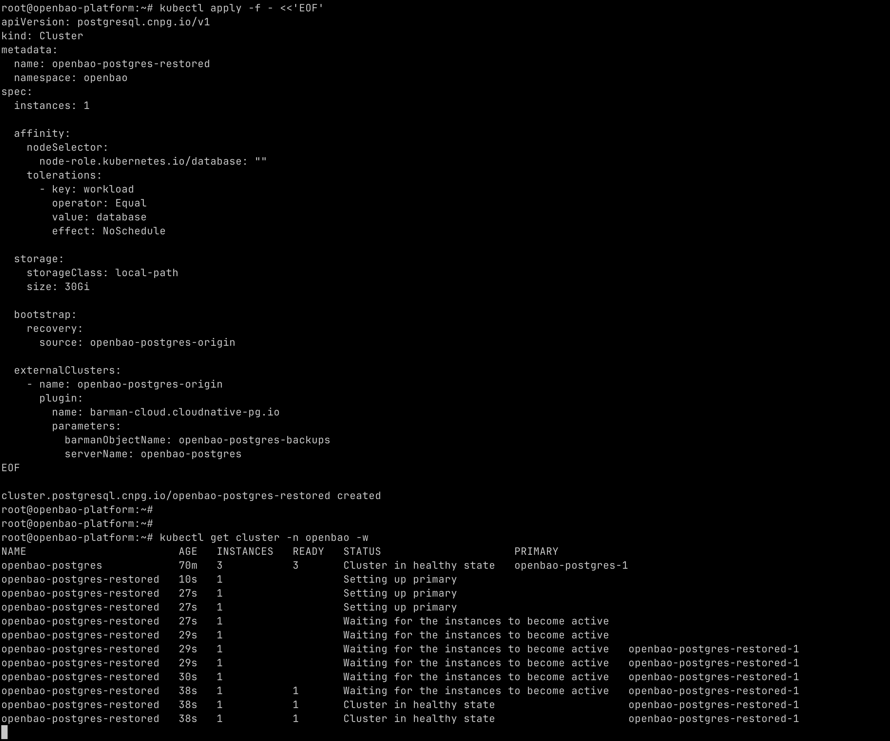

### 8. Openbao is Hihghly available

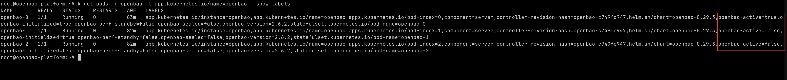

### 9. Openbao storage is Postgres

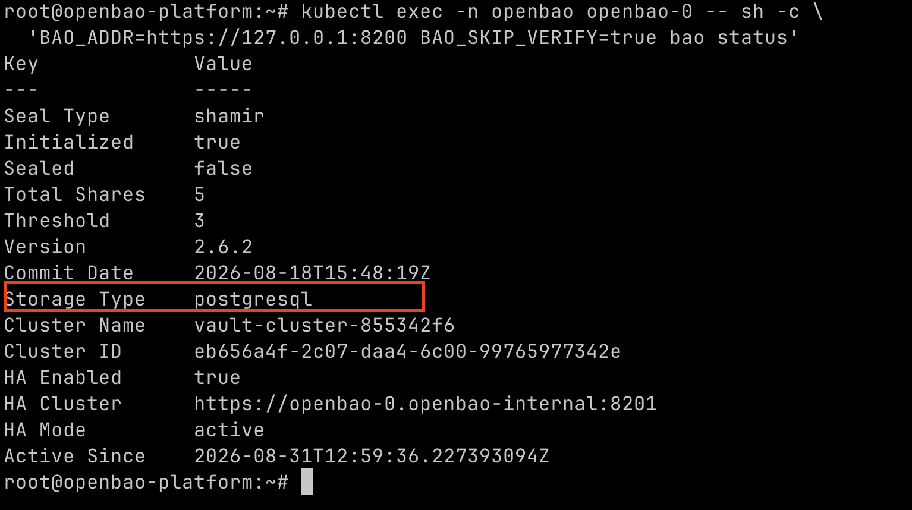

### 10. No local PVC for Openbao

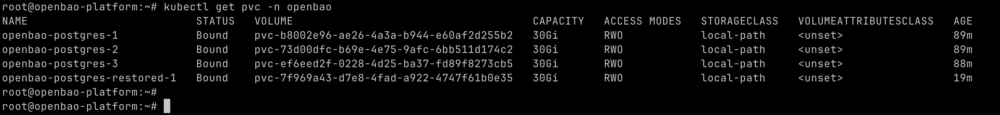

### 11. TLS Exposure

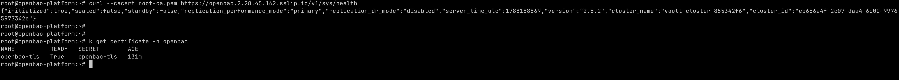

### 12. Secrets synchronisation from OpenBao to Kubernetes and from Kubernetes to OpenBao

### Pull: OpenBao -> Kubernetes

These 3 steps in the screenshot shows secrets synchronisation from OpenBao into the K8s cluster
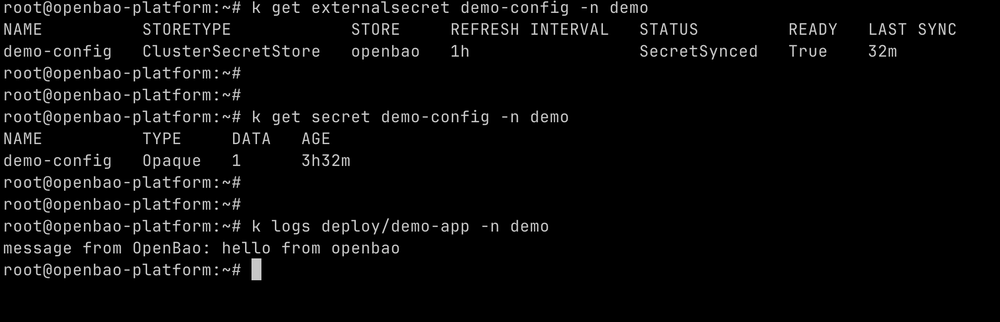

### Push: Kubernetes -> OpenBao

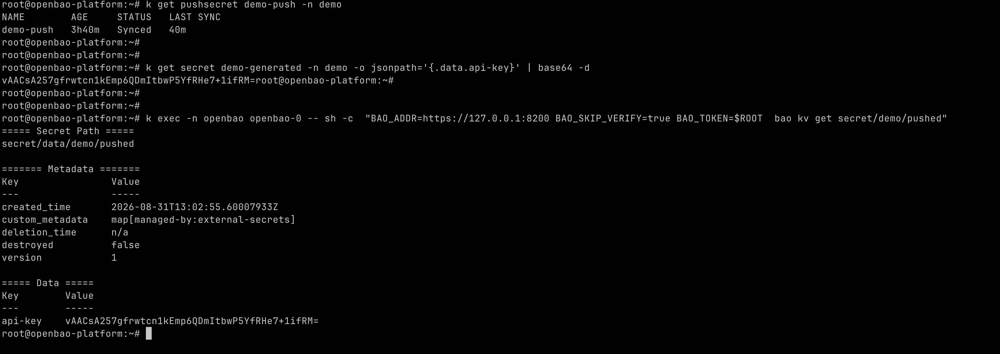

## Observability with Prometheus and Grafana

### Monitoring pods

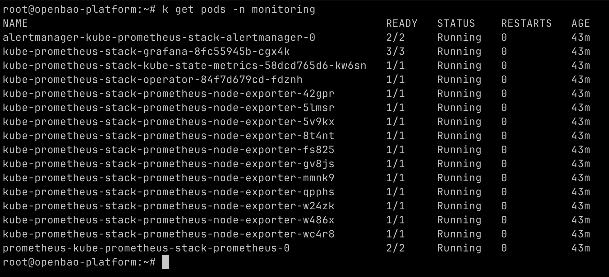

### Node exporter pod on each node

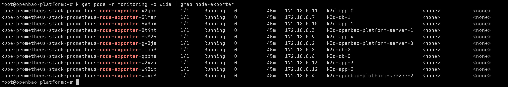

### Grafana TLS for secure access

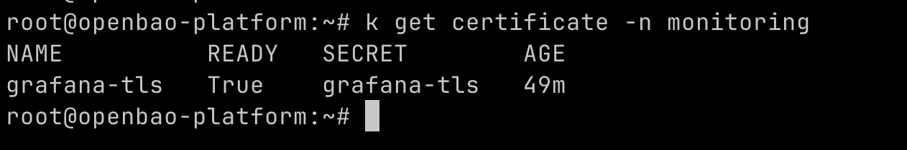

### Grafana K8s cluster Node Metrics

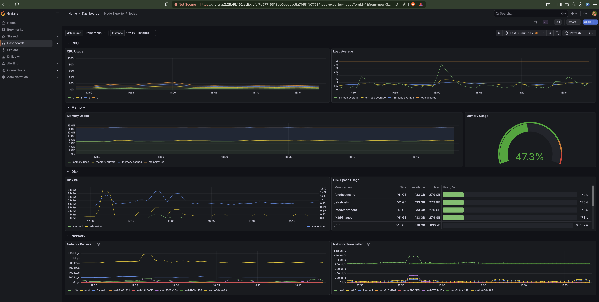

### Metrics of pods in the namespace openbao

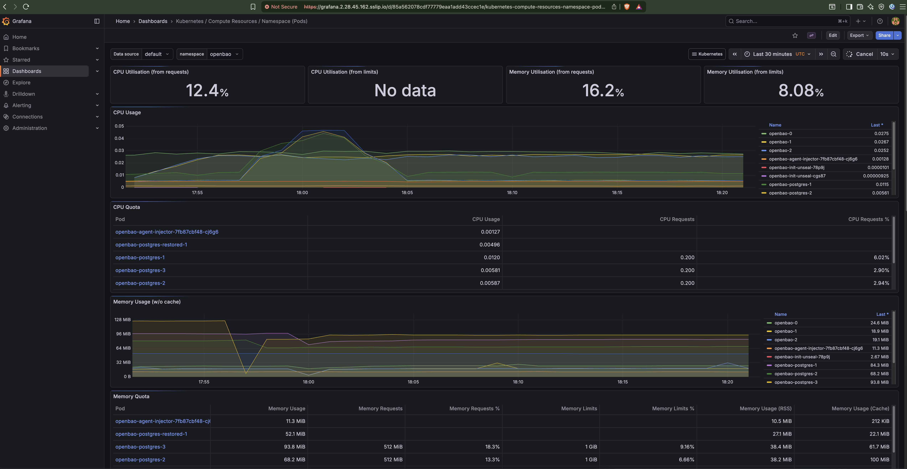

### External secrets network traffic

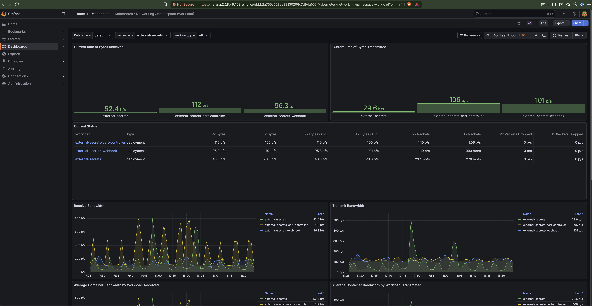

### Compute resource usage of the cluster

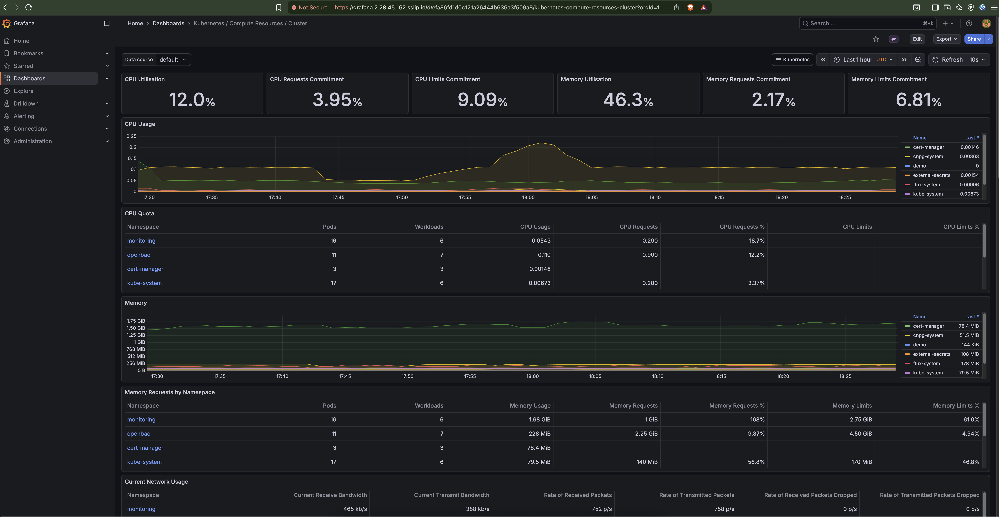

## Request flow

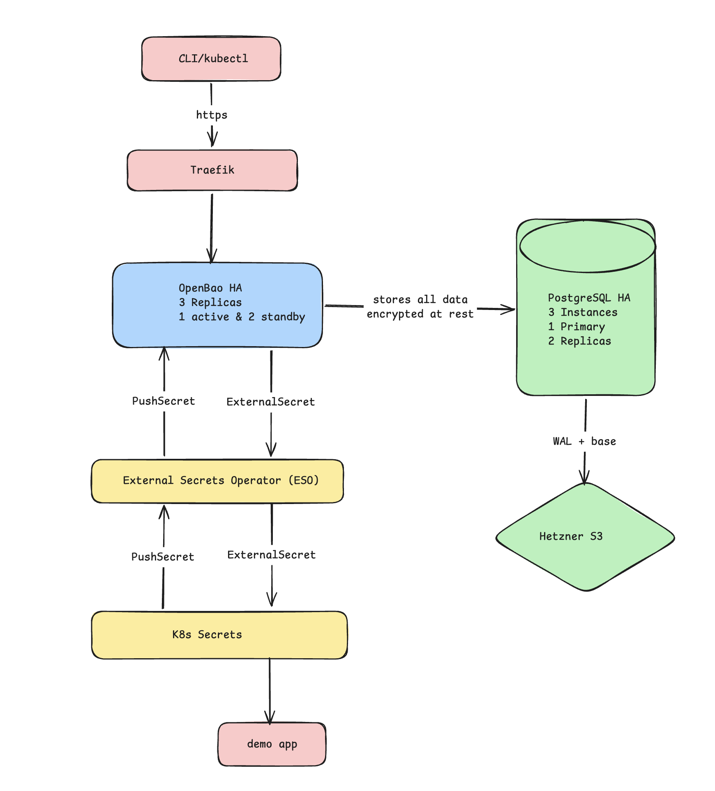

Traffic from outside comes in over HTTPS on port 443 and hits Traefik first. Traefik looks at the hostname in the TLS handshake and sends the connection to OpenBao without decrypting it. OpenBao holds its own certificate and terminates TLS itself, so the traffic stays encrypted the whole way.

OpenBao's active replica takes all reads and writes whiles the other two serves as a standby for the full HA. The OpenBao pods do not store anything on disk as everything OpenBao stores goes into PostgreSQL and it is encrypted before it gets there.

PostgreSQL runs 3 instances. One primary takes the writes, two replicas then stream from it. Backups leave the cluster and go to a Hetzner S3 bucket, as nightly base backups plus a continuous WAL stream. That combination is what allows a restore to any point in time.

Secrets move in both directions through the External Secrets Operator:

- An `ExternalSecret` pulls a value out of OpenBao and writes it into a Kubernetes Secret. The demo app reads it from its environment.
- A `PushSecret` does the reverse. It takes a Kubernetes Secret and writes it into OpenBao.

The demo app never talks to OpenBao, it's job is to just read a normal Kubernetes Secret and ESO keeps that Secret in sync.

## Architecture Decisions

This part of my documentation explains my implementation approach for the platform and the reasoning behind each decision along the way. It will grow as I build out each part of the platform, starting here with the multi-node Kubernetes cluster setup and the PostgreSQL solution as first 2 point of the key requirements. Later sections cover OpenBao's configuration, the External Secrets workflow, and how GitOps with Flux ties everything together.

## 1. Multi-node Kubernetes cluster with proper scheduling capabilities

### 1.1 Tool: k3d

I considered four options for running a local cluster, which will eventually be run on a VM due to resource constraints on my local setup. These options are kind, minikube, k3d and running k3s directly on virtual machines.

|                         | Node scaling                                                                                                                                                                                                                                                                                                                     | Load balancing                                                                                             | Resource footprint                                                                                     |
| ----------------------- | -------------------------------------------------------------------------------------------------------------------------------------------------------------------------------------------------------------------------------------------------------------------------------------------------------------------------------- | ---------------------------------------------------------------------------------------------------------- | ------------------------------------------------------------------------------------------------------ |
| **k3d** (k3s in Docker) | A live operation. You can add or remove nodes on a running cluster without touching the rest of it, using `k3d node create` and `delete`.                                                                                                                                                                                        | Built in. Ships with a load balancer in front of the API server, plus ServiceLB and Traefik for workloads. | Lightest option. Uses containers instead of VMs, and k3s itself strips out components it doesn't need. |
| **kind**                | Fixed at creation time through a config file. Changing the node count means tearing the cluster down and recreating it.                                                                                                                                                                                                          | Not built in. Needs a separate ingress or load balancer setup.                                             | Moderate. Docker based, closer to vanilla upstream Kubernetes.                                         |
| **minikube**            | The `--nodes` flag only applies at creation time, and multi-node support is newer and less mature. Running multiple control-plane nodes specifically requires the `--ha` flag, which is fixed at a minimum of three and mixes control-plane and worker roles together. There's no way to get dedicated control-plane-only nodes. | Not built in.                                                                                              | Heaviest option. Runs a full VM or driver per cluster.                                                 |

I settled with k3d for this implementation. It was the only option that gave a direct, single-command control over independently sized control-plane and worker pools (`k3d cluster create --servers 3 --agents 8`). It also gives live node scaling while I iterate on the manifests and a built-in load balancer and ingress path.

One trade-off here is that, every k3d "node" is a Docker container sharing the same host kernel, basically, so this isn't real node isolation. k3d's own documentation describes it as a lightweight wrapper to run k3s in Docker, built for local development, not production. In a real production environment, k3s would run directly on separate hosts or VMs instead.

### 1.2 Cluster topology: 3 control-plane nodes, 3 database workers, and 5 generic workers (11 nodes total)

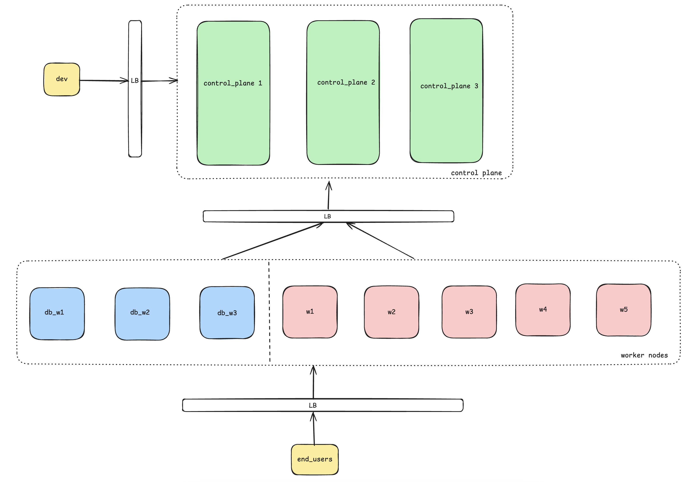

**Control plane (3 nodes, tainted NoSchedule)**

Three is the minimum number that gives etcd a real majority. Quorum works out to `⌊n/2⌋+1`, so with three nodes that's two, meaning the cluster can tolerate exactly one node going down. Two control-plane nodes wouldn't actually help here as it offers no quorum advantage over a single node, just an extra machine to maintain for the same fault tolerance.

Each control-plane node runs its own etcd member next to its API server. The alternative is external etcd, where etcd runs on its own separate machines. I went with stacked because it is what k3s gives you natively, and it is also kubeadm's default for HA clusters. External etcd would be the stronger choice as it splits two things that stacked etcd ties together. With stacked, losing a control-plane node loses an etcd member at the same time, so one failure costs you two things instead of one. Keeping them apart means a control-plane failure does not touch the database that holds all cluster state. External etcd setup will require a whole extra set of machines which is at least 3 more nodes, considering this cluster already have 11 nodes running

The control-plane nodes are tainted so that only core services (kube-apiserver, etcd, the scheduler and the controller-manager) run on them. Every platform component, including Flux, runs on the worker node instead.

**Database workers (3 nodes, tainted, local storage)**

Postgres has to write to disk (fsync) on every commit before it's considered saved, so disk speed directly becomes transaction speed. Shared or network storage adds delay to every write, and it gets worse and less predictable when other workloads are using that same storage at the same time. Giving Postgres its own dedicated node with local disk means nothing else competes for that disk, so performance stays consistent.

Each of the 3 Postgres replicas always gets its own separate node. So if a node goes down, it only ever takes one replica with it, never two or three at once and this is what actually makes having 3 replicas useful for HA.

The downside of local storage is that data lives on one node, but that's covered by Postgres's own replication across all three dedicated nodes. If one node dies, the other two already have up to date copies. CloudNativePG and GKE/EKS/AKS all recommend this same setup for running a Postgres in HA mode.

**Generic workers (5 nodes)**

Every other remaining components run here on the worker node including OpenBao, cert-manager, the External Secrets Operator (ESO), Flux and the demo workload. Unlike the database tier, these components do not get their own dedicated node. They share the 5 generic nodes based on how Kubernetes decides to place them. Each one has its own number of replicas based on what it actually needs, not based on how many nodes exist. One theing I did here is to try not to put two replicas of the same thing on the same node.

Each component only runs as many copies as it actually needs for HA, not one copy per node. Running a copy of everything on every node would likely create resources wastage on extra copies that do nothing meaningful.

## 2. PostgreSQL solution for Kubernetes

### 2.1 Chosen: CloudNativePG (CNPG)

I looked at five operators: CloudNativePG, the Zalando Postgres Operator, the Percona Operator for PostgreSQL, Crunchy Data PGO, and StackGres.

|                                 | HA mechanism                                                                                                                                                                              | License and image access                                                      | Adoption                                                                                                                                                                                  |
| ------------------------------- | ----------------------------------------------------------------------------------------------------------------------------------------------------------------------------------------- | ----------------------------------------------------------------------------- | ----------------------------------------------------------------------------------------------------------------------------------------------------------------------------------------- |
| **CloudNativePG**               | Built into the operator itself. No Patroni, no external DCS like etcd or Consul. It uses the Kubernetes API server directly for leader election, coordinated through a per-cluster lease. | Apache 2.0, fully open, images are freely redistributable.                    | Ranked first in usage share (27.6%, up from 6.1% the year before), around 8,000 GitHub stars, and it's Microsoft's officially recommended pattern for running production Postgres on AKS. |
| Zalando Postgres Operator       | Patroni plus an external DCS.                                                                                                                                                             | Open, no gating.                                                              | Long track record and battle-tested at Zalando's own scale, but usage share has been declining (7.9%) and releases have slowed.                                                           |
| Percona Operator for PostgreSQL | Patroni plus pgBackRest.                                                                                                                                                                  | Apache 2.0, open, no gating.                                                  | Solid and fully open, but with a smaller community than CNPG.                                                                                                                             |
| Crunchy Data PGO                | Patroni plus pgBackRest.                                                                                                                                                                  | Source is Apache 2.0, but the official images require a paid Crunchy account. | Mature and trusted in enterprise settings, but the image access restriction gets in the way of free reproducibility.                                                                      |
| StackGres                       | Patroni plus a bundled stack (PgBouncer, Envoy, Fluentd, Prometheus).                                                                                                                     | AGPL, which is copyleft.                                                      | Niche, and the heaviest resource footprint of the group.                                                                                                                                  |

CNPG unlike the other options all run Patroni, a separate process that sits next to Postgres and handles failover and leader election on its own. It's another piece of software with its own version, and it has to stay compatible with whatever Postgres version is running. StackGres adds even more on top of that.
CNPG skips Patroni entirely as it just asks Kubernetes directly who the leader is and handles failover through that, so there's one less moving part to manage and keep updated. It's also just the option most people are actually using now. It passed the older Patroni-based tools in real adoption, not just hype, so the track record backs up the simpler design.

For backups, CNPG uses Barman Cloud. It constantly ships the WAL, basically a running log of every change, to S3-compatible storage, on top of regular full backups on a schedule. Because of that constant WAL stream, I'm not stuck restoring to whenever the last backup happened. I can restore to any specific moment, like a few seconds before a bad migration ran, instead of losing everything since the last snapshot. This is one way to achieve one of the backups requirement.

### 2.2 Why PostgreSQL over OpenBao's Integrated Storage

OpenBao's Integrated Storage, based on Raft, is actually the simpler and more common choice for HA since it needs no external database at all. I used PostgreSQL here because it is part of the mentioned requirements and because it gives a chance to demonstrate operating a real stateful backend under GitOps, including replication, backup and restore, and node placement, rather than relying on Raft's self-contained consensus.

## 3. OpenBao Configuration

### 3.1 High availability with a PostgreSQL backend

OpenBao runs 3 replicas from the official Helm chart. All three point at the same PostgreSQL database, and the config sets `ha_enabled = "true"` in the `storage "postgresql"` section. That flag makes OpenBao create a table called `openbao_ha_locks`. The pod that holds the row is the active node and serves every read and write. The other two run as standby and forward nothing until they win the lock. So leader election happens inside the database itself and not in OpenBao.

`service_registration "kubernetes" {}` makes OpenBao label its own pods as it changes state. The chart's `openbao-active` Service selects on that label, so traffic always lands on the current leader without anything external tracking who it is. `dataStorage.enabled` is set to false, so no PersistentVolumeClaim is created
for the OpenBao pods. Any pod can be deleted and rescheduled to a different node with no data loss, because there is no data on the node to lose. `kubectl get pvc -n openbao` shows only the three CNPG volumes, which proves that OpenBao does not store any data.

### 3.2 Initialisation and unsealing

A Job runs after the StatefulSet comes up which checks whether OpenBao is already initialised. If not, it calls `/v1/sys/init`, which returns 5 Shamir key shares and a root token, and it writes them into the `openbao-unseal-keys` Secret. It then unseals each of the three pods using 3 of the 5 shares. The init response is the only time those keys ever exist. OpenBao does not store them and cannot reissue them, so if that Secret is lost the data is unrecoverable no matter how good the database backups are.

### 3.3 Kubernetes auth for ESO

A second Job configures OpenBao once it is unsealed and does the following:

- Enables the kv-v2 secrets at `secret/`
- Enables the Kubernetes auth method
- Writes an `eso-policy`, that grants read and write access on `secret/data/*` and `secret/metadata/*`
- Also creates an `eso-role` which is bound to the `external-secrets` ServiceAccount in the `external-secrets` namespace

The Job targets the `openbao-active` Service and every API call checks for errors. An earlier version used the headless Service and plain `curl`, which silently succeeded against a sealed node and reported success while creating nothing and in effect producing a confusing 403 errors

### 3.4 What the database sees

Every value OpenBao writes is encrypted before it reaches PostgreSQL, and the paths are also masked. `SELECT parent_path, key FROM openbao_kv_store` returns rows like `logical/<uuid>/<uuid>/metadata/<hash>`. The string `demo` does not appear anywhere, even though that is the name of the secret. So full read access to the database yields neither the secret values nor their names and this is also important because the backups in object storage are copies of the same database.

## 4. External Secrets workflow

### 4.1 ClusterSecretStore and authentication

A single `ClusterSecretStore` named `openbao` defines how ESO reaches OpenBao. It is cluster-scoped rather than namespaced so any namespace can use it without repeating the configuration. Authentication uses OpenBao's Kubernetes auth method. ESO presents its own ServiceAccount token, OpenBao calls the Kubernetes TokenReview API to verify it, and if the ServiceAccount matches `eso-role` it issues a token carrying `eso-policy`. The store verifies OpenBao's TLS certificate using `caProvider`, pointed at the root CA Secret that cert-manager created. It does not skip verification.

I started with AppRole and switched to Kubernetes auth. AppRole means a role ID and secret ID that have to be created, stored somewhere and rotated, which is another bootstrap secret. Kubernetes auth removes that entirely by reusing an identity the cluster already issues and manages.

### 4.2 Both directions of secrets flow

- `ExternalSecret demo-config` reads `secret/demo/config` from OpenBao and writes a Kubernetes Secret named `demo-config`. The demo app mounts it as the `MESSAGE` environment variable.
- `PushSecret demo-push` does the reverse. A Job generates a random API key into a Secret called `demo-generated`, and ESO writes that value up into `secret/demo/pushed`.

The demo-app does not communicate with OpenBao; it reads the Kubernetes Secret, while ESO keeps the Secret in sync with OpenBao. This allows the workload to remain unaware of where the secrets are actually stored.

### 4.3 PushSecret limitations

The push direction is quiet weaker than the pull and the reasons for this are as follows:

- **It is an alpha API:** `ExternalSecret` uses `external-secrets.io/v1` while `PushSecret` is still `v1alpha1` which means it is less stable. Future ESO upgrades may change or remove some fields and compatibility is not guaranteed.
- **kv-v2 metadata is required:** Every write to kv-v2 also creates a metadata entry, regarldess of the `deletionPolicy`. The policy must therefore allow access to `secret/metadata/*` or the push operation fails with a 403 error.

- **Last writer wins:** If anothe. process changes the same path in OpenBao, the next push will overwrite the existing value without detecting the conflict.

- **`deletionPolicy: None` leaves secrets behind:** Deleting the PushSecret does not remove the value from OpenBao. This is safer, but it means Git does not fully reflect what is stored in OpenBao

- **The direction changes the trust model:** Pull treats OpenBao as the source of truth while Push allows a k8s secrets to write values to OpenBao. This means users who can create Secrets in that namespace may also be able to modify the secret store which implies access should be tightly controlled with RBAC in production.

## 5. TLS

### 5.1 Certificate source

All certificates are automatically created and managed by **cert-manager** in the cluster. Flux manages the setup, so we don’t create certificates manually or store them in Git. The steps involved in generating the certificate are outlined below

1. `selfsigned-bootstrap`: A temporary issuer used only to create the root CA.
2. `openbao-platform-root-ca`: the root CA certificate. It is valid for 10 years and uses ECDSA P-256. Its certificate and private key. are stored in `openbao-platform-root-ca-secret`
3. `openbao-platform-ca`: The main CA used to issue all the certificate needed by the platform

Two certificates are created from this CA, `openbao-tls` and `grafana-tls`. Both are valid for 90days and are automatically renewed by cert manager when 15days are left.

For this exercise, using a self-signed certificate is fine, however in production the root CA could be replaced with a trusted CA such as Let's encrypt. The rest of the setup will remain unchanged.

### 5.2 Why passthrough is used instead of terminating TLS at Traefik

OpenBao uses Traefik `IngressRouteTCP` with `passthrough: true`. Traefik reads the hostname from the TLS connection and forwards the encrypted traffic directly to OpenBao which implies OpenBao handles its own TLS certificate. This keeps the connection encrypted from the client all the way to OpenBao which is very essential for a secrets manager.

Grafana works differently in this case. It uses a normal `IngressRoute` with TLS handled by Traefik because Grafana uses HTTP internally.

Both uses the `websecure` entrypoint and Traefik uses SNI to route traffic to the correct service.

## 6. GitOps with Flux

### 6.1 Layout

```
clusters/openbao-platform/   13 Flux Kustomizations, one per component
platform/                    the manifests each one applies
apps/                        demo workload
infra/                       Terraform for the VM and the bucket
docs/                        standalone runbooks
```

Each component has its own Kustomization instead of using one large Kustomization for everything. This means if one component fails, it does not stop the others from being deployed and that only the affected component needs to be checked.

### 6.2 Ordering

`dependsOn` defines the order in which components are deployed. It makes sure that a component is deployed only after the components it depends on are ready.
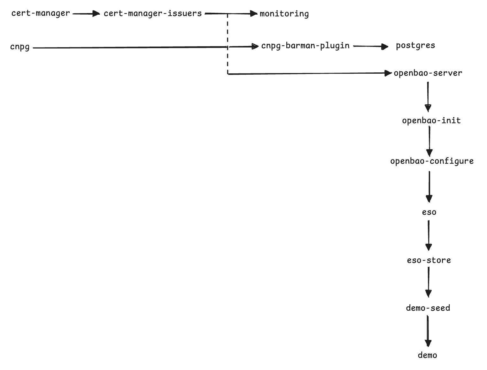

There are 2 main rules which were used to determine the deployment order.

1. Custom Resource Definitions (CRDs) must exist before they are used. `cert-manager` and `ESO` are split into seperate `controller` and `resources` Kustomizations. This ensures the controller creates the CRD before resources such as `Certificate` or `ClusterSecretStore` are deployed. The same applies to the Barman plugin's `ObjectStore`.

2. Some components also depend on runtime configuration. For example, ESO needs `eso-role` from `openbao-configure` before it can authenticate. This is handled with `dependsOn` Each Kustomization uses `prune: true` and `wait: true` which implies FLux removes resources that are deleted from Git and waits for resources to become ready before moving on to dependent components.

### 6.3 What is done manually, and why

Only the bootstrap script is run manually (via terraform), as allowed by the exercise. It installs Docker, k3d and kubectl, creates the cluster, configures the nodes, creates the `sops-age` Secret and runs `flux bootstrap`. After that, all platform changes are made through Git commits. There are however, two exceptions and these are outlined below:

1. **`sops-age`.** Flux needs the decryption key before it can read the encrypted files and therefore the key cannot be stored in Git and must be created seperately.

2.**Restartting OpenBao pods after a config change.** The chart uses `updateStrategy: OnDelete`, so the StatefulSet does not automatically restart the pods and this must be done manually when required.

## 7. Bootstrap secrets with SOPS

The exercise requires that backup credentials are not stored in OpenBao and this is to avoid a dependency loop.

OpenBao stores its data in PostgreSQL and PostgreSQL backups need S3 credentials. If those credentials were stored in OpenBao, restoring PostgreSQL would require OpenBao, while OpenBao itself would require the PostgreSQL database being restored.

SOPS breaks this dependency. The backup credentials are encrypted in Git, while the decryption key is provided separately by Terraform. An age key pair is used for encryption. The public key is stored in `.sops.yaml` and committed to Git because it is not a secret, the private key however is not commited to Git. It stored locally in `terraform.tfvars` which is gitignored and Terraform creates the `sops-age` Secret in the cluster during the VM boostrap.

The configuration uses `encrypted_regex: ^(data|stringData)$`, which encrypts only the Secret values. The resource name, namespace, and other metadata remain visible, making the encrypted files easier to review and manage. When Flux reconciles the configuration, the kustomize-controller retrieves the private key from `sops-age`, decrypts the Secret in memory and applies it to the cluster. The unencrypted values are never stored in Git. A full walkthrough is in [docs/sop-encryption.md](docs/sop-encryption.md)

For production, I would use a cloud KMS instead of storing a raw age private key in a tfvars file. A KMS provides access control and auditing for key usage and removes the need to keep the private key on an individual machine.

## Observability

Prometheus, Grafana, Alertmanager, kube-state-metrics, and node-exporter are deployed through Flux using the `kube-prometheus-stack` HelmRelease. Grafana is available over HTTPS on its own hostname and uses the same CA as OpenBao.

node-exporter is configured to run on all 11 nodes. This ensures that the database and control-plane nodes are also monitored.

Four scrape targets are disabled and these are kube-controller-manager, kube-scheduler, kube-proxy, and etcd. In k3s, these components run together in a single process and do not provide separate metrics endpoints and keeping them enabled would result in constantly failing targets.

### These are the selected Items I would alert on

| Signal                                                         | Why it matters                                                      |
| -------------------------------------------------------------- | ------------------------------------------------------------------- |
| OpenBao is sealed or has no active nodes                       | The platform is down and secrets cannot be accessed.                |
| PostgreSQL primary is unavailable or replica lag is increasing | PostgreSQL stores OpenBao's data.                                   |
| `ContinuousArchiving` is false                                 | WAL archiving has stopped, which can affect point-in-time recovery. |
| No successful backup in 24h                                    | Indicates that scheduled backups may not be running.                |
| Certificate expires within 14 days                             | Indicates that automatic certificate renewal may not be working.    |
| Flux Kustomization is not Ready for over 15 minutes            | Indicates that the cluster may be out of sync with Git.             |
| High pod restart rate or OOMKills                              | Can indicate memory or application issues.                          |
| Node disk usage is above 85%                                   | A full node can affect workloads and PostgreSQL storage.            |

### How I would troubleshoot

This is the order I would use when troubleshooting

1. Check flux first: `flux get kustomizations -A`. If Flux has not applied the configuration, the other checks will be of no help.
2. Check controller logs: `kubectl logs -n flux-system deploy/kustomize-controller`. These logs usually explaind why a resource failed or is not ready.
3. Check the application logs as welll as the sidecar logs as issues such as backup failures may only appear here.
4. Check k8s events. `kubectl get events -n <ns> --sort-by=.lastTimestamp` helps identify schedulling, images and other related k8s problems
5. Check Grafana and look out for trends such as increasing memory usage, frequent pod restarts or CPU throttling.

### What is missing

There are currently no log collection or tracing. For production, I would add Loki for log collection as this would make issues like the backup failure easier to find without having to manually check different
containers.

Alertmanager is deployed with the default rules, but no notification receiver is configured. In a real environment, it would be connected to a notification system such as email, Slack, or PagerDuty. This was left out of the demo because there is no real destination for alerts.

## Production-ready vs simplified for the demo

### Implementations that are Production-ready

| Area                       | Why it's production ready                                                                                                                                  |
| -------------------------- | ---------------------------------------------------------------------------------------------------------------------------------------------------------- |
| GitOps                     | All components are managed by Flux with clear deployment order, cleanup, and health checks.                                                                |
| OpenBao HA with PostgreSQL | PostgreSQL manages the leader election, so the pods do not keep their own local state. The Service always points to the active leader.                     |
| PostgreSQL HA              | CNPG runs 3 instances with automatic failover and replication between them.                                                                                |
| Backups                    | Nightly backups and continuous WAL archiving are stored in object storage and kept for 30 days. The restore process is also documented and tested.         |
| Secret management          | Kubernetes authentication is used instead of storing static credentials. TLS is verified using a trusted CA, and secrets can be synced in both directions. |
| Bootstrap secrets          | SOPS keeps sensitive credentials encrypted in Git and outside OpenBao, avoiding a dependency loop during recovery.                                         |
| Certificates               | cert-manager automatically creates and renews certificates.                                                                                                |
| Workload isolation         | Labels and taints keep database workloads on dedicated nodes, and pod placement is checked to make sure this is working.                                   |

### Implementation that has been simplified for this demo

| Simplification                  | What production would use                                                                                    |
| ------------------------------- | ------------------------------------------------------------------------------------------------------------ |
| k3d on one VM                   | Separate physical or cloud nodes. The current 11 nodes share the same VM, so the separation is only logical. |
| Self-signed CA                  | Let's Encrypt or the organisation's internal CA.                                                             |
| `sslip.io` hostnames            | Proper DNS names.                                                                                            |
| Shamir unseal                   | Automatic unsealing using a KMS or another secure key management system.                                     |
| `local-path` storage            | Shared or replicated storage so data is not lost if a node fails.                                            |
| Age key in `terraform.tfvars`   | Cloud KMS with access control and key usage logs.                                                            |
| Alertmanager without a receiver | Connect it to PagerDuty, Slack, email, or another alerting system.                                           |
| Metrics only                    | Add Loki for logs and tracing when needed.                                                                   |
| Single environment              | Separate development, staging, and production environments managed through Git.                              |
| Root token retained             | Revoke the root token after setup and use proper authentication methods for normal access.                   |

## Known limitations

**1. Auto-unseal is not configured.** OpenBao uses Shamir key shares, so after a restart, the pods become sealed and must be unsealed manually. This also affects the other OpenBao pods. The StatefulSet starts pods in order, but a sealed pod is not considered ready. As a result, if `openbao-0` is sealed, `openbao-1` and `openbao-2` will not start. This means that restarting one OpenBao pod can take the whole HA setup offline until the pods are manually unsealed.

The re-running of the init Job fixes this, but it has to be done manually. In production, auto-unseal would use a cloud KMS or another OpenBao transit engine. This would remove the need for manual unsealing and prevent the other pods from being blocked.

**2. The Helm chart uses `updateStrategy: OnDelete`.** OpenBao pods do not automatically restart when its configuration changes. Flux applies the change, but the running pods continue using the old configuration until they are manually restarted. This helps avoid unexpected outages, but then also means this part is not fully automated through GitOps.

**3. The VMs public IP is hardcoded in two certificates.** Both `openbao-tls` and `grafana-tls` use a hostname based on the VM's public IP. If the IP changes it implies the certificates need to be updated. Terraform keeps the IP the same but using proper DNS in production would avoid this dependency.

**4. All 11 nodes share one machine.** The nodes are seperated logically using labels and taints but they are still running on the same VM. If that VM fails, the entire platform goes down.

**5. `local-path` storage is tied to a specific node.** If that node is lost, its PostgreSQL volume is also lost. This is manageable here because there are 3 PostgreSQL instances and backups are stored outside the cluster. Replicated storage would be much safer in production.

**6. The root token is still in a Secret.** The `openbao-unseal-keys` Secret contains the root token and unseal keys. This is convenient for the demo and is used by the configuration Job. In production, the root token should be revoked after the initial setup.

**7. Backups are linked to a specific PostgreSQL cluster.** If the cluster is completely rebuilt, the new PostgreSQL cluster has a different identity. Barman will therefore not use the old cluster's WAL archive. The old archive must be removed or the new cluster must use a different `serverName`. In production, the existing cluster would normally be restored rather than completely rebuilt, keeping the backup history connected.

## Time spent

| Task                                               | Time                                               |
| -------------------------------------------------- | -------------------------------------------------- |
| Research and architecture decisions                | 3 days                                             |
| Terraform infrastructure and VM bootstrap          | 1 day                                              |
| k3d cluster, node tiers, taints and labels         | 1 day (done on same day as Terraform VM bootsrap)  |
| Flux bootstrap and GitOps structure                | 2 days                                             |
| cert-manager and TLS                               | 1 day                                              |
| CloudNativePG and the PostgreSQL cluster           | 1 day (same day as cert manager and tls work)      |
| OpenBao deployment, init, unseal and configuration | 4 days                                             |
| External Secrets Operator, both directions         | 4 days (same day as above)                         |
| Backups to object storage and restore rehearsal    | 4 days (same day as above)                         |
| SOPS for bootstrap secrets                         | 4 days (same day as above)                         |
| Prometheus and Grafana                             | 1 day                                              |
| Documentation                                      | 1 day (same day with prometheus and Grafana setup) |
| **Total**                                          | 12 days spent in total                             |

---

## Some References

- [kind, Quick Start and multi-node configuration](https://kind.sigs.k8s.io/docs/user/quick-start/)
- [minikube, Multi-Node Clusters](https://minikube.sigs.k8s.io/docs/tutorials/multi_node/) and [Multi-Control-Plane HA Clusters](https://minikube.sigs.k8s.io/docs/tutorials/multi_control_plane_ha_clusters/)
- [k3d, Overview](https://k3d.io/stable/) and [K3s features in k3d](https://k3d.io/v5.7.5/usage/k3s/)
- [K3s docs, Architecture](https://docs.k3s.io/architecture) and [High Availability Embedded etcd](https://docs.k3s.io/datastore/ha-embedded)
- [Kubernetes, Options for Highly Available Topology (kubeadm)](https://kubernetes.io/docs/setup/production-environment/tools/kubeadm/ha-topology/)
- [etcd, FAQ (quorum and sizing)](https://etcd.io/docs/v3.7/faq/) and [Disaster recovery](https://etcd.io/docs/v3.5/op-guide/recovery/)
- [CloudNativePG, Architecture](https://cloudnative-pg.io/documentation/1.26/architecture/) and [Storage](https://cloudnative-pg.io/documentation/1.25/storage/)
- [CNCF, CloudNativePG project page](https://www.cncf.io/projects/cloudnativepg/)
- [EDB, CloudNativePG: The Most Popular Postgres Operator in 2023](https://www.enterprisedb.com/blog/cloudnativepg-the-most-popular-postgres-operator-in-2023) and [Why one of the world's leading clouds adopted CloudNativePG](https://www.enterprisedb.com/blog/cloudnativepg-why-one-worlds-leading-clouds-adopted-gold-standard-postgres-kubernetes)
- [Google Cloud, Isolate your workloads in dedicated node pools (GKE)](https://cloud.google.com/kubernetes-engine/docs/how-to/isolate-workloads-dedicated-nodes)
