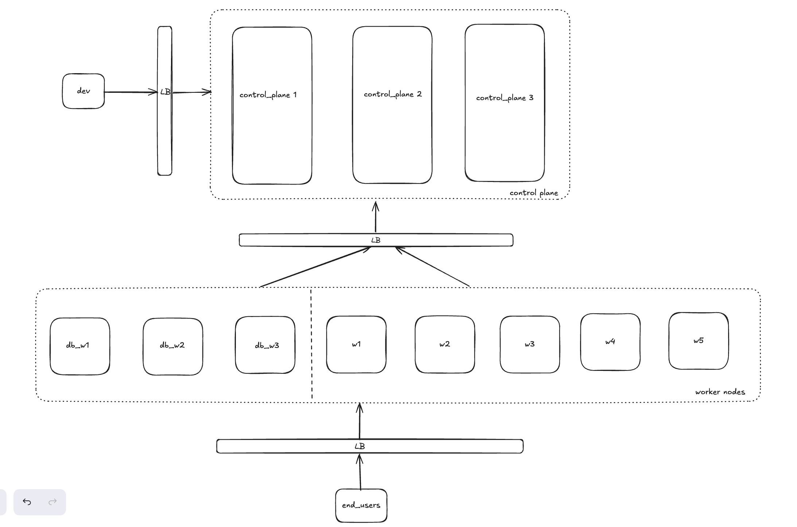

# Architecture Decisions

This document explains my implementation approach for the platform and the reasoning behind each decision along the way. It will grow as I build out each part of the platform, starting here with the multi-node Kubernetes cluster setup and the PostgreSQL solution as first 2 point of the key requirements. Later sections cover OpenBao's configuration, the External Secrets workflow, and how GitOps with Flux ties everything together.

## 1. Multi-node Kubernetes cluster with proper scheduling capabilities

### 1.1 Tool: k3d

I considered four options for running a local cluster. These options are: kind, minikube, k3d and running k3s directly on virtual machines.

|                         | Node scaling                                                                                                                                                                                                                                                                                                                     | Load balancing                                                                                             | Resource footprint                                                                                     |
| ----------------------- | -------------------------------------------------------------------------------------------------------------------------------------------------------------------------------------------------------------------------------------------------------------------------------------------------------------------------------- | ---------------------------------------------------------------------------------------------------------- | ------------------------------------------------------------------------------------------------------ |
| **k3d** (k3s in Docker) | A live operation. You can add or remove nodes on a running cluster without touching the rest of it, using `k3d node create` and `delete`.                                                                                                                                                                                        | Built in. Ships with a load balancer in front of the API server, plus ServiceLB and Traefik for workloads. | Lightest option. Uses containers instead of VMs, and k3s itself strips out components it doesn't need. |
| **kind**                | Fixed at creation time through a config file. Changing the node count means tearing the cluster down and recreating it.                                                                                                                                                                                                          | Not built in. Needs a separate ingress or load balancer setup.                                             | Moderate. Docker based, closer to vanilla upstream Kubernetes.                                         |
| **minikube**            | The `--nodes` flag only applies at creation time, and multi-node support is newer and less mature. Running multiple control-plane nodes specifically requires the `--ha` flag, which is fixed at a minimum of three and mixes control-plane and worker roles together. There's no way to get dedicated control-plane-only nodes. | Not built in.                                                                                              | Heaviest option. Runs a full VM or driver per cluster.                                                 |

I settled with k3d for this implementation. It was the only option that gave a direct, single-command control over independently sized control-plane and worker pools (`k3d cluster create --servers 3 --agents 8`). It also gives live node scaling while I iterate on the manifests and a built-in load balancer and ingress path.

One trade-off here is that, every k3d "node" is a Docker container sharing the same host kernel, basically, so this isn't real node isolation. k3d's own documentation describes it as a lightweight wrapper to run k3s in Docker, built for local development, not production. In a real production environment, k3s would run directly on separate hosts or VMs instead.

### 1.2 Cluster topology: 3 control-plane nodes, 3 database workers, and 5 generic workers (11 nodes total)

**Control plane (3 nodes, tainted NoSchedule)**

Three is the minimum number that gives etcd a real majority. Quorum works out to `⌊n/2⌋+1`, so with three nodes that's two, meaning the cluster can tolerate exactly one node going down. Two control-plane nodes wouldn't actually help here. It offers no quorum advantage over a single node, just an extra machine to maintain for the same fault tolerance.

This tier runs stacked etcd, meaning each control-plane node runs its own etcd member right alongside its API server, rather than external etcd running on a separate set of machines. I stick with kubeadm's default HA topology, and it's what k3s's embedded etcd gives you natively. External etcd would have been the better setup choice here as it seperates two failure domains that stacked etcd couples together. Loosing a control plane won't loose an etcd member at the same time and the etcd itself. External etcd setup will require a whole extra set of machines which is at least 3 more nodes, considering this cluster already have 11 nodes running

The control-plane nodes are tainted so that only core services (kube-apiserver, etcd, the scheduler and the controller-manager) run here. Every platform component, including Flux, runs on the worker pool instead.

**Database workers (3 nodes, tainted, local storage)**

Postgres has to write to disk (fsync) on every commit before it's considered saved, so disk speed directly becomes transaction speed. Shared or network storage adds delay to every write, and it gets worse and less predictable when other workloads are using that same storage at the same time. Giving Postgres its own dedicated node with local disk means nothing else competes for that disk, so performance stays consistent.

Each of the 3 Postgres replicas always gets its own separate node, no two replicas ever share one. So if a node goes down, it only ever takes one replica with it, never two or three at once. That's what actually makes having 3 replicas useful for HA.

The downside of local storage is that data lives on one node, but that's covered by Postgres's own replication across all three dedicated nodes. If one node dies, the other two already have up to date copies. CloudNativePG and GKE/EKS/AKS all recommend this same setup, but that's confirmation it works, not the reason for choosing it.

It's worth noting that OpenBao itself doesn't need this tier. Because it uses a PostgreSQL storage backend (more on that in section 2), OpenBao's pods hold no meaningful local state of their own. Postgres does all the persisting, so OpenBao runs comfortably on the generic pool instead.

**Generic workers (5 nodes)**

Every other remaining components run here including OpenBao (3 replicas), cert-manager, the External Secrets Operator, Flux, and the demo workload. Unlike the database tier, none of these get their own dedicated node. They just share the 5 generic nodes, however Kubernetes decides to place them. Each one has its own number of replicas based on what it actually needs, not based on how many nodes exist. (One rule here is I try not to put two replicas of the same thing on the same node. This I think can be reviewed later and adjusted based on needs).

Each component only runs as many copies as it actually needs for HA, not one copy per node. Running a copy of everything on every node would just waste resources on extra copies doing nothing useful.

DaemonSet allows to run exactly one copy per node but that's meant for things tied to a specific node, like network plugins or log collectors. None of these components work that way, so it doesn't apply here.

**Access paths**

There are three separate load-balanced paths here, not one:

1. Devs, kubectl and CI traffic go through k3d's built-in load balancer to whichever control-plane node is currently healthy.
2. Worker kubelets go through k3s's own agent-embedded, client-side load balancer to whichever control-plane node is healthy. This is a different mechanism from the first path. It's built into the k3s agent process itself, not something k3d adds, but it serves the same purpose. Kubelets never hardcode a specific control-plane node's address, so losing a control-plane node doesn't strand any workers.
3. End users go through ServiceLB (k3s inbuilt load balancer) and Traefik to the generic workers only. Because the database tier is tainted, no ingress or application pod can ever be scheduled there, so end-user traffic never reaches the database nodes no matter how the ingress routes things.

## 2. PostgreSQL solution for Kubernetes

### 2.1 Chosen: CloudNativePG (CNPG)

I looked at five operators: CloudNativePG, the Zalando Postgres Operator, the Percona Operator for PostgreSQL, Crunchy Data PGO, and StackGres.

|                                 | HA mechanism                                                                                                                                                                              | License and image access                                                      | Adoption                                                                                                                                                                                  |
| ------------------------------- | ----------------------------------------------------------------------------------------------------------------------------------------------------------------------------------------- | ----------------------------------------------------------------------------- | ----------------------------------------------------------------------------------------------------------------------------------------------------------------------------------------- |
| **CloudNativePG**               | Built into the operator itself. No Patroni, no external DCS like etcd or Consul. It uses the Kubernetes API server directly for leader election, coordinated through a per-cluster lease. | Apache 2.0, fully open, images are freely redistributable.                    | Ranked first in usage share (27.6%, up from 6.1% the year before), around 8,000 GitHub stars, and it's Microsoft's officially recommended pattern for running production Postgres on AKS. |
| Zalando Postgres Operator       | Patroni plus an external DCS.                                                                                                                                                             | Open, no gating.                                                              | Long track record and battle-tested at Zalando's own scale, but usage share has been declining (7.9%) and releases have slowed.                                                           |
| Percona Operator for PostgreSQL | Patroni plus pgBackRest.                                                                                                                                                                  | Apache 2.0, open, no gating.                                                  | Solid and fully open, but with a smaller community than CNPG.                                                                                                                             |
| Crunchy Data PGO                | Patroni plus pgBackRest.                                                                                                                                                                  | Source is Apache 2.0, but the official images require a paid Crunchy account. | Mature and trusted in enterprise settings, but the image access restriction gets in the way of free reproducibility.                                                                      |
| StackGres                       | Patroni plus a bundled stack (PgBouncer, Envoy, Fluentd, Prometheus).                                                                                                                     | AGPL, which is copyleft.                                                      | Niche, and the heaviest resource footprint of the group.                                                                                                                                  |

CNPG unlike the other options all run Patroni, a separate process that sits next to Postgres and handles failover and leader election on its own. It's another piece of software with its own version, and it has to stay compatible with whatever Postgres version is running. StackGres adds even more on top of that.
CNPG skips Patroni entirely. It just asks Kubernetes directly who the leader is and handles failover through that, so there's one less moving part to manage and keep updated. It's also just the option most people are actually using now. It passed the older Patroni-based tools in real adoption, not just hype, so the track record backs up the simpler design.

For backups, CNPG uses Barman Cloud. It constantly ships the WAL, basically a running log of every change, to S3-compatible storage, on top of regular full backups on a schedule. Because of that constant WAL stream, I'm not stuck restoring to whenever the last backup happened. I can restore to any specific moment, like a few seconds before a bad migration ran, instead of losing everything since the last snapshot. This is one way to achieve one of the backups requirement.

### 2.2 Why PostgreSQL over OpenBao's Integrated Storage

OpenBao's Integrated Storage, based on Raft, is actually the simpler and more common choice for HA since it needs no external database at all. I used PostgreSQL here because it is part of the mentioned requirements and because it gives a chance to demonstrate operating a real stateful backend under GitOps, including replication, backup and restore, and node placement, rather than relying on Raft's self-contained consensus. It's a more involved exercise, and a better test of the platform engineering skills that is being assesed here.

---

## References

- [kind, Quick Start and multi-node configuration](https://kind.sigs.k8s.io/docs/user/quick-start/)
- [minikube, Multi-Node Clusters](https://minikube.sigs.k8s.io/docs/tutorials/multi_node/) and [Multi-Control-Plane HA Clusters](https://minikube.sigs.k8s.io/docs/tutorials/multi_control_plane_ha_clusters/)
- [k3d, Overview](https://k3d.io/stable/) and [K3s features in k3d](https://k3d.io/v5.7.5/usage/k3s/)
- [K3s docs, Architecture](https://docs.k3s.io/architecture) and [High Availability Embedded etcd](https://docs.k3s.io/datastore/ha-embedded)
- [Kubernetes, Options for Highly Available Topology (kubeadm)](https://kubernetes.io/docs/setup/production-environment/tools/kubeadm/ha-topology/)
- [etcd, FAQ (quorum and sizing)](https://etcd.io/docs/v3.7/faq/) and [Disaster recovery](https://etcd.io/docs/v3.5/op-guide/recovery/)
- [CloudNativePG, Architecture](https://cloudnative-pg.io/documentation/1.26/architecture/) and [Storage](https://cloudnative-pg.io/documentation/1.25/storage/)
- [CNCF, CloudNativePG project page](https://www.cncf.io/projects/cloudnativepg/)
- [EDB, CloudNativePG: The Most Popular Postgres Operator in 2023](https://www.enterprisedb.com/blog/cloudnativepg-the-most-popular-postgres-operator-in-2023) and [Why one of the world's leading clouds adopted CloudNativePG](https://www.enterprisedb.com/blog/cloudnativepg-why-one-worlds-leading-clouds-adopted-gold-standard-postgres-kubernetes)
- [Google Cloud, Isolate your workloads in dedicated node pools (GKE)](https://cloud.google.com/kubernetes-engine/docs/how-to/isolate-workloads-dedicated-nodes)
